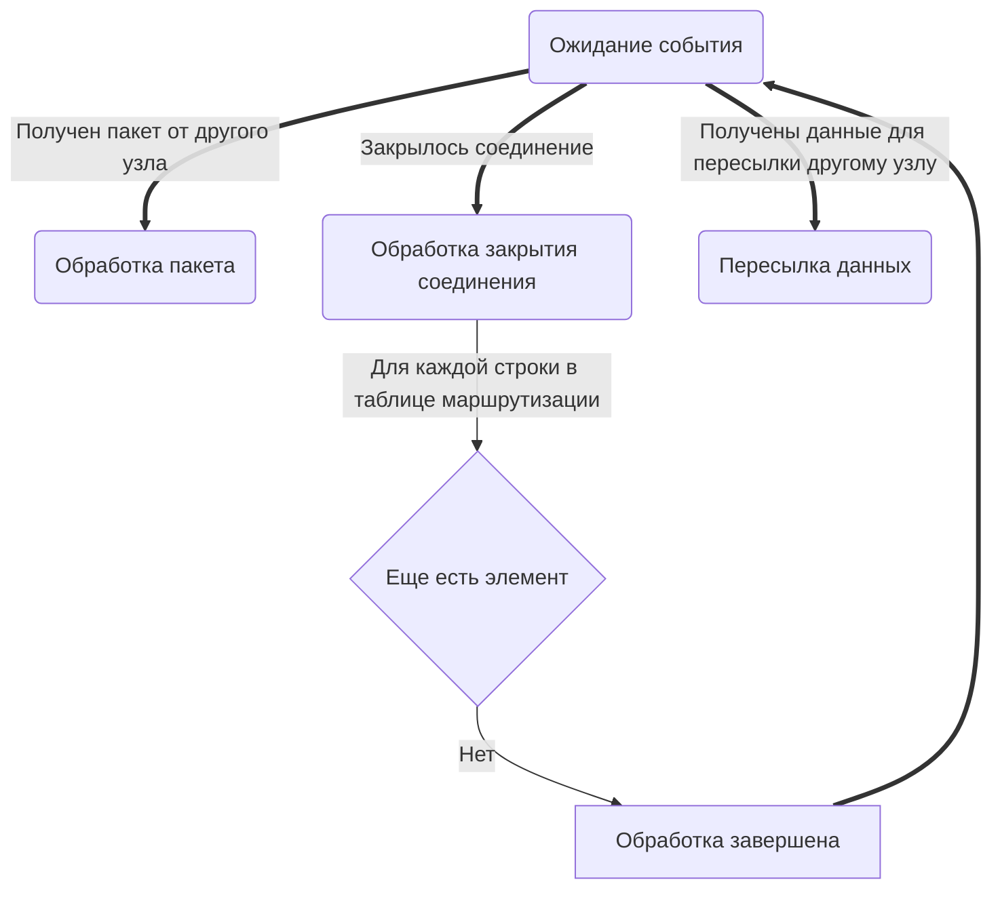

# Спецификация QORP

## Аннотация
QORP (Quite Ok Routing Protocol) это реактивный протол динамической маршрутизации третьего уровня OSI 
предназначеный для организации ad hoc mesh-сетей без какой либо конфигурации (в прямом режиме) 
или с минимальной конфигурацией (в оверлейном режиме поверх интернета). 
Протокол обеспечивает приватность передаваемых данных и равномерное криптографическое распредленеие адресов без единого центра координации.

## Лицензирование
<p>
    <a rel="license" href="http://creativecommons.org/licenses/by/4.0/">
        
    </a>
    <br />
    Данная спецификация распространяется под лицензией <a rel="license" href="http://creativecommons.org/licenses/by/4.0/">Creative Commons Attribution 4.0 International License</a>.
</p>

## Мотивация
Задача построения распределенной mesh-сети лишеной единых точек отказа, устойчивой к динамическому изменению топологии и защищенной криптографически достаточно давно стоит в сообществе сетевых энтузиастов. Однако все решения этой задачи известные на текущий момент страдают от оверинжиниринга и черезвычайно усложнены в попытках приблизиться к идеалу. Также из их сложности проистекает их плохая задокументированность и большие запутанные кодовые базы реализаций. QORP не стремиться быть идеальным, ведь лучшее - враг хорошего. Вместо этого он старается быть просто достаточно хорошим решением, при этом оставаясь простым как для понимания, так и для реализации.

## Версионирование
В описании протокола маршрутизации QORP используется [семантическое версионирование](https://semver.org/lang/ru/).  
Мажорная версия увеличивается при внесении значителньх, **не** обратносовместимых изменений.  
Минорная версия увеличивается при внесении значительных **но** обратносовместимых ихменений.  
Патч версия увеличивается при внесении любых других изменений в протокол.  
Версии **не** увеличиваются при внесении уточнений, исправлении текстовых ошибок и других изменениях документа но не логики проткола.  
Протоколы транспортных соединений, протоколы делегирования управления маршрутизацией, протокол IPv6 поверх QORP и т.д. описываются в отдельных файлах и верисонируются отакже отдельно.  
Текущая версия протокола `0.0.1`  

## Терминология
Ключевые cлова **"ДОЛЖЕН" (MUST)**, **"НЕ ДОЛЖЕН» (MUST NOT)"**, **"ОБЯЗАТЕЛЬНО" (REQUIRED)**, **"СЛЕДУЕТ" (SHOULD)**, **"НЕ СЛЕДУЕТ" (SHOULD NOT)**, **"РЕКОМЕНДОВАННЫЙ" (RECOMMENDED)**, **"МОЖЕТ" (MAY)** и **"НЕОБЯЗАТЕЛЬНЫЙ" (OPTIONAL)** в этом документе должны быть интерпретированы в соответствии с [IETF RFC 2119](http://www.ietf.org/rfc/rfc2119.txt).  

**Узел(node)** - самодостаточный элемент сети. Узлы так или иначе соединяются друг с другом образуя **сеть** 
и действуют согласно протоколу **QORP** чтобы обеспечить доставку **пакетов** между друг другом.
  
**Сеть** - совокупность **узлов** соедиенных друг с другом.
  
**Пир(peer)** - эквивалент термина **узел** используемый когда речь идет о двух узлах между которыми есть **прямое соединение**. 
  
**Прямое соединение** также **транспортное соединение** - непосредственное соединение между двумя **узлами** **сети** вне самой **сети**. 
Может осуществляться поверх других протоколов и сетей.
  
**Пакет** - массив байт определённой структуры, имеющий конечную длину и передающийся между **узлами**.
  
**Маршрут** - последовательность **прямых соединений** между **узлами** через которые **пакет** должен пройти чтобы попасть от одного **узла** к другому. 

**Отправитель** - **узел** который создает и отправляет пакет в **сеть**.

**Получатель** - **узел** которому предназначается **пакет**.

**Транзитный/промежуточный узел** - **узел** который лежит на маршруте между **отправителем** и **получателем**.

## Алгоритм маршрутизации

### Абстракция соединения
Здесь и далее при описании логики маршрутизации QORP упоминается **канал**. Под **каналом** прониматся абстракци над **прямым соединением**.  
Пока **канал** существует, в него могут отправляться **пакеты** и из него могут получаться **пакеты**.  
Абстракция канала не предоставляет гарантий доставки/целостности/упорядоченности пакетов.  
**Каналы** создаются и уничтожаются логикой внешней относительно логики маршртуизации.  
О **канале** не известно ничего кроме того что по ту сторону канала находится другой **узел**.  

### Поиск маршрута
Когда одному **узлу**(обозначим как *А*) требуется передать данные другому **узлу**(обозначим как *Б*), ему требуется найти для этого **маршрут** в **сети**.  
Для этого, **узел** *А* отправляет **пакет** с запросом поиска маршрута в каждый открытый **канал** который у него имеется.  
Каждый **узел**, получивший этот **пакет**, если он не является **узлом** *Б*, перенаправляет этот пакет также во все свои каналы кроме того, из которого **пакет** был получен, используя технику split horizon.  
   
Когда **пакет** поиска маршрута достигает **узла** *Б*, **узел** *Б* отвечает **пакетом** подтверждения маршрута, который доставляется обратно к **узлу** *А*, по пути пройденому **пакетом** поиска маршрута.  
После этого **маршрут** от *А* к *Б* считается согласованным и по нему могут передаваться пакеты с полезной нагрузкой.  

### Передача данных
**Узел** *А* формирует криптографически защищенные (как это описывается ниже) **пакеты** с данными и передает их по **маршруту** согласованному на прошлом этапе.

### Отклонение маршртуа
Если **узел** через котоырй идет траффик от **узла** *А* к **узлу** *Б*, обнаружает, что **канал** через который ему следует переслать **пакет** с данными дальше больше не существует, он формирует **пакет** с сообщением об ошибке маршрутизации и отправляет его обратно по пути к **узлу** *А*.  
Каждый промежуточный **узел**, через который проходит **пакет** ошибки маршрутизации, а также сам **узел** *А*, помечают **канал** откуда пришел этот **пакет** как более не подходящий для доставки **пакетов** к **узлу** *Б*.  
Если по получению **пакета** ошибки маршрутизации **узел** *А* обнаружает что у него более нет известных **маршрутов** для доставки **пакетов** к **узлу** *Б*, то он повторно инициирует процедуру поиска **маршрута**.

## Криптография

### Используемые криптографические примитивы

+ [ChaCha20](https://cr.yp.to/chacha.html) для симметричного шифрования, аутентифицированный [Poly1305](https://cr.yp.to/mac.html), с использованием [RFC7539's AEAD](https://www.rfc-editor.org/rfc/rfc7539)
+ [Curve25519](http://cr.yp.to/ecdh.html) для ECDHE
+ EdDSA
+ [HKDF](https://eprint.iacr.org/2010/264) для деривации ключей, как это описано в [RFC5869](https://www.rfc-editor.org/rfc/rfc5869)

### Применение криптографии в протколе
Каждый **узел** однозначно идентифицируется парой из публичного и приватного ключа EdDSA.  
При взаимодействии между **узлами** в **сети** для идентификации используется публичный ключ, целиком, либо его часть.  
Во время процедуры поиска маршрута **узлами** **отправителем** и **получателем** генерируются пары эфимерных ключей Curve25519, на основании которых через процедуру ECDHE вырабатывается общий секрет.  
**Пакеты** с полезной нагрузкой отправляемые в последствии шифруются ChaCha20 и аутентифицируются Poly1305 AEAD.  
При генерации ключа для симметричного шифрования используется HKDF функция над общим секретом и всеми значениями полей **пакетов** запроса маршрута и ответа на запрос маршрута.  

## Сессия
Здесь и далее под сессией подразумевается состояние в которое два узла переходят после обмена пакетами запроса маршрута и ответа на запрос маршрута.  
  
Иниициатор сессии - узел который отправляет пакет поиска маршрута.  
  
Приемник сессии - узел который отвечает на пакет поиска маршрута инициатора.  
  
Идентификатор сессии или SID - 32 битное чило, выбираемое приемником сесии и однозначно идентифицирующее ее для приемника. SID генерируется единожды при открытии сесси и остается неизменным до ее закрытия.  
  
Ключ сессии - симметричный ключ, согласуемый в начале сессии и в дальнейшем обновляемый.  
  
Идентификатор сессионного ключа SKID - 8 битное число, выбираемое приемником сессии и идентифицирующее ключи используемые в рамках сессии.  
  
Открытие сесии - согласование SID, SKID и ключа сессии двумя узлами.  
  
Закрытие сесии - односторонее удаление информации о сессии узлом.  
  
Одновременно у двух узлов может быть только по одной активной сессии в каждом направлении (от первого ко второму и от второго к первому). 
Существующая сессия может быть пересоздана путем повторной процедурой поиска маршрута, что влечет за собой выработку нового SID и нового ключа сессии.  
Также ключ сессии (и соответвенно SKID) может быть обновлен без пересоздания сессии путем обмена специальными служебными пакетами.  
Однако в виду отсутвия гарантии порядка доставки пакетов в сети, пакеты отправленные инициатором до пересоздания сессии или обновления ключа могут достигнуть приемника уже после него.  
Для сохранения возможности расшифровки приемником таких *запоздалых* пакетов СЛЕДУЕТ хранить устаревшие ключи и их идентификатры некоторое время прежде чем удалять их.  
  
Как уже было указано выше, SID однозначно идентифицирует сессию для приемника.  
Для инициатора же, сессия однозначно идентифицируется адресом приемника т.к. не допускается существование более чем одной сессии в направлени от инициатора к приемнику одновременно.  
  
Сессиия может быть прекращена по одной из следующих причин:
+ При ичерпании пространства возможных значений SID и необходимости принять новую сессию, приемник может закрыть одну из уже существующих.
+ Инициатор может закрыть либо пересоздать сессию, в случае если у него не останется известных маршрутов до приемника.

## Структура пакетов

Во время анализа пакетов, при наличии в них поля переменной длины следует понимать под длиной этого поля расстояние от его начала до конца пакета.  
Во время анализа пакетов, при условии что все поля имеют константную длину, байты между концом последнего поля и концом пакета (при их наличии) должны игнорироваться и не восприниматься как ошибка.  
Во время анализа пакетов, пакеты неизвестного типа должны игнорироваться.  

### RouteRequest
Поля:
| № | Имя         | Смещение | Длина    | Описание                                                                      |
| - | ----------- | -------- | -------- | ----------------------------------------------------------------------------- |
| 0 | PackageType | 0 байт   | 1 байт   | Тип пакета; Константа 0                                                       |
| 1 | Destination | 1 байт   | 16 байт  | *Первые* 128 бит публичного ключа **получателя**                              |
| 2 | Source      | 17 байт  | 32 байта | Полный публичный ключ **отправителя**                                         |
| 3 | RID         | 49 байт  | 8 байт   | Идентификатор запроса                                                         |
| 4 | SourceEph   | 57 байт  | 32 байта | Эфемерный публичный ключ **отправителя**                                      |
| 5 | Sign        | 89 байт  | 64 байта | Подпись EdDSA **отправителя** рассчитанная от конкатенинации предыдущих полей |
| 6 | TTL         | 153 байт | 1 байт   | Ограничение на колличество узлов пройденных пакетом                           |
| 7 | LT          | 154 байт | 1 байт   | Счетчик узлов пройденых пакетом                                               |

**Узел** **ДОЛЖЕН**(MUST) генерировать новую эфемерную пару ключей Curve25519 *каждый* раз при формировании нового RouteRequest **пакета**.  
**Узел** **ДОЛЖЕН**(MUST) инкрементировать RID *каждый* раз при формировании нового RouteRequest **пакета**.  
Подпись рассчитывается для фргамента сообщения c 0 по 88 байт включительно.  
Рекомендуется инициализировать TTL значением 64.  
При каждом получении RouteRequest **узел** **ДОЛЖЕН**(MUST) инкрементировать счетчик LT, если он меньше 255 и декрементимровать TTL, если он больше 0.  
Если **узлу** требуется переслать RouteRequest **пакет**, далее но в нем счетчик TTL равен 0, либо счетчик LT равен 255, пакет дожен быть отброшен.  

### RouteResponce
Поля:
| № | Имя         | Смещение | Длина    | Описание                                                                      |
| - | ----------- | -------- | -------- | ----------------------------------------------------------------------------- |
| 0 | PackageType | 0 байт   | 1 байт   | Тип пакета; Константа 1                                                       |
| 1 | Destination | 1 байт   | 16 байт  | *Последние* 128 бит публичного ключа **получателя**                           |
| 2 | Source      | 17 байт  | 32 байта | Полный публичный ключ **отправителя**                                         |
| 3 | RID         | 49 байт  | 8 байт   | Идентификатор запроса                                                         |
| 4 | SourceEph   | 57 байт  | 32 байта | Эфемерный публичный ключ **отправителя**                                      |
| 5 | SID         | 89 байт  | 4 байта  | Идентификатор сессии                                                          |
| 6 | SKID        | 93 байт  | 1 байт   | Идентификатор ключа сессии                                                    |
| 7 | Sign        | 94 байт  | 64 байта | Подпись EdDSA **отправителя** рассчитанная от конкатенинации предыдущих полей |
| 8 | TTL         | 158 байт | 1 байт   | Ограничение на колличество узлов пройденных пакетом                           |

**Узел** **ДОЛЖЕН**(MUST) генерировать новую эфемерную пару ключей Curve25519 *каждый* раз при формировании нового RouteResponce **пакета**.  
**Узел** **ДОЛЖЕН**(MUST) использовать RID из того RouteRequest **пакета** на который он отвечает этим RouteResponce **пакетом**.  
**Узел** **ДОЛЖЕН**(MUST) сгененрировать SID таким образом, чтобы у него не было одновременно нескольких активных сессий с одинаковыми SID.   
Подпись рассчитывается для фргамента сообщения c 0 по 93 байт включительно.  
Рекомендуется инициализировать TTL значением 64, либо значением LT из того RouteRequest **пакета** на который **узел** отвечает этим RouteResponce **пакетом**, если оно больше.  
При каждом получении RouteResponce **узел** **ДОЛЖЕН**(MUST) инкрементировать счетчик LT, если он меньше 255 и декрементимровать TTL, если он больше 0.  
Если **узлу** требуется переслать RouteResponce **пакет**, далее но в нем счетчик TTL равен 0, либо счетчик LT равен 255, пакет дожен быть отброшен.  

### RouteError
Поля:
| № | Имя             | Смещение | Длина    | Описание                                                                |
| - | --------------- | -------- | -------- | ----------------------------------------------------------------------- |
| 0 | PackageType     | 0 байт   | 1 байт   | Тип пакета; Константа 2                                                 |
| 1 | UnreachableNode | 1 байт   | 16 байт  | *Последние* 128 бит публичного ключа **узла** который более не достижим |
| 2 | UnreachableFor  | 17 байт  | 4 байта  | SID сессии                                                              |

### NetData
Поля:
| № | Имя             | Смещение | Длина    | Описание                                            |
| - | --------------- | -------- | -------- | --------------------------------------------------- |
| 0 | PackageType     | 0 байт   | 1 байт   | Тип пакета; Константа 3                             |
| 1 | Destination     | 1 байт   | 16 байт  | *Последние* 128 бит публичного ключа **получателя** |
| 2 | SID             | 17 байт  | 4 байта  | Идентификатор сессии                                |
| 3 | SKID            | 21 байт  | 1 байт   | Идентификатор ключа сессии                          |
| 4 | Nonce           | 22 байт  | 12 байт  | ChaCha20-Poly1305 Nonce                             |
| 5 | Payload         | 34 байт  | N байт   | Зашифрованная полезная нагрузка                     |

**Узел** **ДОЛЖЕН**(MUST) использовать SID из последнего RouteResponce или UpdateKeysResponce **пакета** возвращенного **получателем**.  
  
Вложенная полезная нагрузка может быть следующих типов и иметь следующую структуру:

#### PlainData
Вложенные поля:
| № | Имя             | Смещение | Длина    | Описание                                            |
| - | --------------- | -------- | -------- | --------------------------------------------------- |
| 0 | PayloadType     | 0 байт   | 1 байт   | Тип полезной нагрузки; Константа 0                  |
| 1 | Data            | 1 байт   | N байт   | Данные                                              |

#### UpdateKeysRequest
Вложенные поля:
| № | Имя             | Смещение | Длина    | Описание                                            |
| - | --------------- | -------- | -------- | --------------------------------------------------- |
| 0 | PayloadType     | 0 байт   | 1 байт   | Тип полезной нагрузки; Константа 1                  |
| 1 | RID             | 1 байт   | 8 байт   | Идентификатор запроса                               |
| 2 | SourceEph       | 9 байт   | 32 байта | Новый эфемерный публичный ключ **отправителя**      |


**Узел** **ДОЛЖЕН**(MUST) генерировать новую эфемерную пару ключей Curve25519 *каждый* раз при формировании нового NetData.UpdateKeysRequest **пакета**.  
**Узел** **ДОЛЖЕН**(MUST) инкрементировать RID *каждый* раз при формировании нового NetData.UpdateKeysRequest **пакета**.  

#### UpdateKeysResponce
Вложенные поля:
| № | Имя             | Смещение | Длина    | Описание                                            |
| - | --------------- | -------- | -------- | --------------------------------------------------- |
| 0 | PayloadType     | 0 байт   | 1 байт   | Тип полезной нагрузки; Константа 2                  |
| 1 | RID             | 1 байт   | 8 байт   | Идентификатор ключа запроса                         |
| 2 | NewSKID         | 9 байт   | 8 байт   | Новый идентификатор сессии                          |
| 3 | SourceEph       | 17 байт  | 32 байта | Новый эфемерный публичный ключ **отправителя**      |

**Узел** **ДОЛЖЕН**(MUST) генерировать новую эфемерную пару ключей Curve25519 *каждый* раз при формировании нового NetData.UpdateKeysResponce **пакета**.  
**Узел** **ДОЛЖЕН**(MUST) использовать RID из того NetData.UpdateKeysRequest **пакета** на который он отвечает этим NetData.UpdateKeysResponce **пакетом**.  
**Узел** **ДОЛЖЕН**(MUST) сгененрировать SKID таким образом, чтобы на каждую пару SID-SKID которую он хранит, приходилось не более одного сессиионного ключа.  
Рекомендуется генерировать SID инкрементом с переполнением, предварительно удаляя запись для SID+1 (при наличии таковой).  

## Модель поведения узла

### Ограничения модели
В приведенной ниже модели допускается что **узлы** имеют неограниченный объем памяти для хранения состояния. Рекомендации о действиях в условиях конечных объемов памяти предлагаются в главах [Инвалидация кеша](#инвалидация-кеша) и [Рекомендации для реализаций](#рекомендации-для-реализаций).  
  
Приведена ниже модель и в особенности та ее часть, что описывает внутреннее состояние, спроектированна для наглядности и не является оптимальной с точки зрения практического применения.  

### Внутреннее состояние
Каждый **узел** в процессе работы сохраняет следующую информацию:  

#### RouteRequestsTable (Таблица запросов маршрутов)
Поля:
| Поле        | Описание                                          |
| ----------- | ------------------------------------------------- |
| Destination | *Первые* 128 бит публичного ключа **получателя**  |
| Source      | Полный публичный ключ **отправителя**             |
| RID         | Идентификатор запроса                             |
| Inputs      | Список каналов из которых **узел** получал пакет  |
| Outputs     | Список каналов в которые **узел** передавал пакет |

RouteRequestsTable используется маршрутизации служебных пакетов и выполнения техники split horizon посредством следующих правил:  
  
**Узел** **НЕ ДОЛЖЕН**(MUST NOT) принимать один и тот же RouteRequest пакет из одного и того же соединения дважды.  
**Узел** **НЕ ДОЛЖЕН**(MUST NOT) передавать один и тот же RouteRequest пакет в одно и то же соединение дважды.  
**Узел** **НЕ ДОЛЖЕН**(MUST NOT) передавать RouteRequest в те каналы из которых его получал.

#### RouteResponcesTable (Таблица ответов на запросы маршрутов)
Поля:
| Поле        | Описание                                          |
| ----------- | ------------------------------------------------- |
| Destination | *Первые* 128 бит публичного ключа **получателя**  |
| Source      | Полный публичный ключ **отправителя**             |
| RID         | Идентификатор запроса                             |
| Inputs      | Список каналов из которых **узел** получал пакет  |

RouteResponcesTable используется маршрутизации служебных пакетов и выполнения техники split horizon посредством следующих правил:  
  
**Узел** **НЕ ДОЛЖЕН**(MUST NOT) принимать один и тот же RouteResponce пакет из одного и того же соединения дважды.  
**Узел** **НЕ ДОЛЖЕН**(MUST NOT) передавать RouteResponce в те каналы из которых его получал.  

#### RoutingTable (Таблица маршрутизации)
Поля:
| Поле        | Описание                                                                                          |
| ----------- | ------------------------------------------------------------------------------------------------- |
| Destination | Адрес получателя пакета                                                                           |
| SID         | Идентификатор сессии                                                                              |
| RID         | Идентификатор запроса RouteRequest посредством которого был установлен этот маршрут               |
| Inputs      | Каналы из которого пакет от этого **отправителя** и для этого **получателя** может быть получен   |
| Outputs     | Каналы в которые пакет от этого **отправителя** и для этого **получателя** может быть переправлен |

Outgoing массив отсортирован так, что соединения из которых RouteResponce ответ с соответствующим RID пришел раньше, находятся ближе к началу, чем те из которых он пришел пойзже.  
  
Таблица маршрутизации формируется на основе пар связанных транзитных пакетов RouteRequest-RouteResponce.  

#### IncomingSessions (Таблица входящих сессий)
Поля:
| Поле      | Описание                                                          |
| --------- | ----------------------------------------------------------------- |
| SID       | Адрес отправителя пакета                                          |
| SKID      | Номер ключа                                                       |
| Key       | Ключ симметричного шифрования для расшифровки входящих пакетов    |
| Source    | Последние 128 бит публичного ключа узла, установившего эту сессию |
| TimeStamp | Время создания записи                                             |


#### OutgoingSessions (Таблица исходящих сессий)
Поля:
| Поле            | Описание                                                                                |
| --------------- | --------------------------------------------------------------------------------------- |
| Destination     | Первые 128 бит публичного ключа узла c которым установлена либо устанавливается сессиия |
| DestinationFull | Полный публичный ключ узла с которым установлена либо устонавливается сессиия           |
| EphKey          | Приватный эфемерный ключ сгенерированный для установки этой сессии                      |
| SID             | Идентификатор сессии                                                                    |
| SKID            | Идентификатор ключа сессии                                                              |
| Key             | Симметричный ключ шифрования сессии                                                     |

### Словсное описание модели

### Графическое представление модели


### Представленеи модели на псевдокоде
```
при каждом событии
    если это событие получения пакета от другого узла
        если текущий узел является получателем
            если тип пакета RouteRequest
                ..
            если тип пакета RouteResponce
                ..
            если тип пакета RouteError
                ..
            если тип пакета NetData
                ..
            если тип пакета UpdateKeysRequest
                ..
            если тип пакета UpdateKeysResponce
                ..
        если текущий узел не является получателем
            ..
    если это событие закрытия канала
        для каждой записи в таблице маршрутизации
            если канал есть в массиве Incoming
                удалить из массива Incoming
            если канал есть в массиве Outgoing
                удалить из массива Outgoing
                если массив Outgoing опустел
                    для каждого канала в массиве Incoming
                        удалить канал из массива Incoming
                        отправить в канал пакет RouteError{ UnreachableNode = To, UnreachableFor = From }
    если это событие получения данных которые требуется передать другому узлу
        ..
```

## Инвалидация кеша

## Расширения протокола

## Объяснение решений

## Транспорты

## Методы атаки на сеть и способы противодействия им

## Рекомендации для реализаций

- ограничение MTU
- Молчаливый дроп мусроного входящего трафика фаерволом проедпочтиельнее ответа, т.к. это может использоваться как сопосб ддоса как узла получателя, так mddos других узлов
- Если есть blacklist или whitelist правила фервола для входящих пакетов по признаку адреса, лучше исполнять их до криптографической верефикации/расшифровки пакетов
